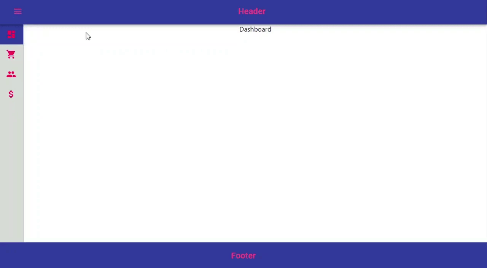

# React Material UI Dashboard Layout template

[Live-Demo](https://katerinalupacheva.github.io/dashboard-layout/)

Starter code with the implementation of:

- Basic layout: header, the main content area with drawer, footer
- Drawer toggle
- Navigation between pages



## Features

- React v.17
- TypeScript v.4
- Material-UI v.4
- React Router v.5
- React Context
- React Hooks
- CSS-in-JS styles
- Responsive
- Create-react-app under the hood

## Quick Start

1. Get the latest version

```shell
git clone https://github.com/KaterinaLupacheva/dashboard-layout.git MyDashboard
cd MyDashboard
```

2. Run

```shell
npm install
```

3. Run

```shell
npm start
```

4. Open [http://localhost:3000](http://localhost:3000) to view it in the browser.

### How to create from scratch

I wrote the blog post on how to create Dashboard layout. You can read it [here](https://ramonak.io/posts/dashboard-layout-react-material-ui).

### Pure React version

The starter code of this Dashboard layout in pure React.js (without Material-UI) is in [this branch](https://github.com/KaterinaLupacheva/dashboard-layout/tree/pure-react).
